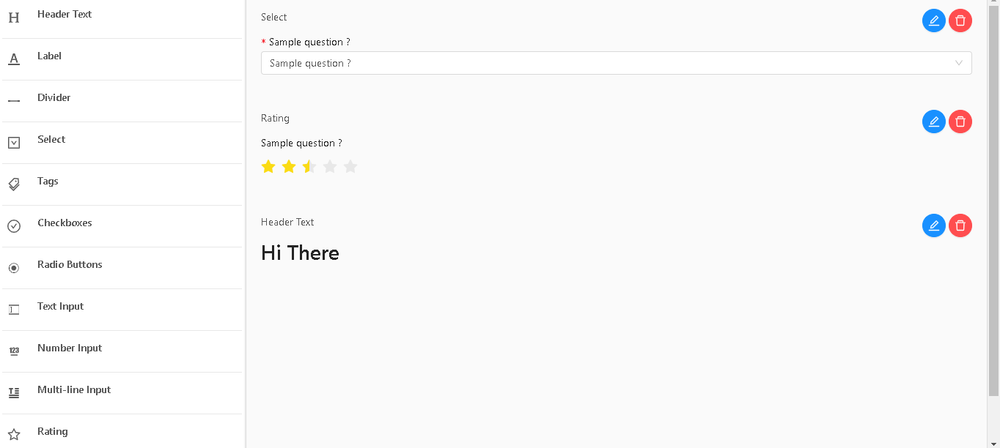

# react-quizzes

[](http://opensource.org/licenses/MIT)
[](https://www.npmjs.com/package/react-quizzes)

Demo:
[](https://codesandbox.io/s/magical-chandrasekhar-88del?fontsize=14&hidenavigation=1&theme=dark)



React form builder and form delivery solution for admins and clients that makes forms easy peasy.
Inspired by abandoned project: https://github.com/blackjk3/react-form-builder

Advantages:

- Supports custom inputs
- Rich text questions
- Supports custom styles
- Internationalization ISO'S
- Internationalization on questions and answers
- Internationalization on Builder
- Centralized form builder and from delivery
- Drag & Drop to order/sort questions on `<QuizzBuilder/>`

## Installation

### Install via NPM

```bash
npm install --save react-quizzes
```

## Style

For components design we use, antd-design componentes and if you just need som simple things we provide the antd style just import it like this:  
`import "react-quizzes/lib/assets/antd.css"`  
For custom styling check [`Custom styles`](#Custom-styles) section

`react-quizzes` requires `react` and `react-dom` as [`peerDependency`](https://docs.npmjs.com/files/package.json#peerdependencies)

# QuizzBuilder

```html
import { QuizzBuilder } from "react-quizzes" <QuizzBuilder onChange={(QuizzData)
=> console.log(form)} />
```

## API

QuizzBuilder component objective is to provide the user a nice and smooth interface to build quizzes

| Props          | Type            | Default                 | Description                                                                      |
| -------------- | --------------- | ----------------------- | -------------------------------------------------------------------------------- |
| `onChange`     | `Function`      | ``                      | will returns builded quizz in QuizzData type                                     |
| `initialValue` | `QuizzData`     | ``                      | initial value to QuizzBuilder, useful if user wants to edit a saved quizz        |
| `toolBox`      | `QuizzToolBox`  | `default QuizzToolBox`  | list of inputs to use, defaults to react-quizz but custom inputs can be supplied |
| `language`     | `string`        | `en`                    | Language that QuizzBuilder will show                                             |
| `messages`     | `QuizzMessages` | `default QuizzMessages` | Object with each language and each language with each text translation           |

# Quiz

A component that provides the final user a quiz/form to fill

```html
import { Quiz } from "react-quizzes" <Quiz data={Mockdata} onSubmit={(values) =>
console.log("form submited values", values)} />
```

## API

| Props          | Type            | Default                 | Description                                                                      |
| -------------- | --------------- | ----------------------- | -------------------------------------------------------------------------------- |
| `data`         | `QuizzData`     | ``                      | data to build the final user form to be filled                                   |
| `onSubmit`     | `Fucntion`      | ``                      | returns the submitted form values                                                |
| `submitButton` | `boolean`       | `true`                  | shows/hides default submit button\*                                              |
| `toolBox`      | `QuizzToolBox`  | `default QuizzToolBox`  | list of inputs to use, defaults to react-quizz but custom inputs can be supplied |
| `language`     | `string`        | `en`                    | Language that Quiz questions and options will show                               |
| `messages`     | `QuizzMessages` | `default QuizzMessages` | Object with each language and each language with each text translation           |

- if submit button is hidden the default onSubmit will not work, you must implement a custom submit

## Custom submit

There is a prop `wrappedComponentRef` that gives you access to make basically anything, reset form, set initial values change the values based on something....

[`wrappedComponentRef`](https://github.com/react-component/form#note-use-wrappedcomponentref-instead-of-withref-after-rc-form140)

```jsx
import { Quiz } from "react-quizzes";

saveQuizRef = (quizRef) => {
  // saves Quizz component ref
  this.quizRef = quizRef;
};
// custom submit function
handleCustomSubmit = () => {
  const form = this.quizRef.props.form;
  form.validateFields((err, values) => {
    if (!err) {
      // if no errors, no errors means required answers are filled
      console.log("Received values of form: ", values);
      form.resetFields(); // resets form after recieveing values
    }
  });
};
<Fragment>
  <Quiz
    wrappedComponentRef={this.saveQuizRef}
    submitButton={false} // hides inside submit button
    data={Mockdata}
  />
  <Button onClick={this.handleCustomSubmit}>Custom Submit btn</Button>
</Fragment>;
```

# Translations/Internationalization

New languages support can be added or replace the existing ones  
[Existing translations](./src/translations/TranslatedText.tsx#defaultMessages)

[](https://codesandbox.io/s/react-quizzesexample-ru-locale-wx50m?fontsize=14&hidenavigation=1&theme=dark)

```javascript
import { QuizzBuilder } from "react-quizzes"
import { defaultMessages } from "react-quizzes/lib/translations/TranslatedText";

// existing keys can be found on above link
defaultMessages["pt"]={
  "toolbox.textinput.name": "Caixa de Texto",
  "confirm.action": "Tem a  certeza?",
  "btn.yes": "Sim",
  "btn.no": "Não",
  "btn.add": "Adicionar",
  ...
}
function App() {
    return <QuizzBuilder
            onChange={(form) => console.log(form)}
            language="pt"
            messages={toolBoxItems}
        />
}
```

# Custom Inputs

Custom inputs can be added to Toolbox, but Toolbox already supplies a great variety of inputs, if you have a new input suggestions fell free to contact this library contributors.

The Toolbox is used on QuizzBuilder and Quiz, so if you created a form with custom input on QuizzBuilder supply the same toolbox to Quiz component so it can display the input

[Existing Toolbox](./src/ToolBox/index.tsx)

## How to add custom input

You just have to pass the prop `toolBox` and add your new entry to the existing toolbox items, or if you don't want to reuse the existing one just make your one

```javascript
import { QuizzBuilder } from "react-quizzes"
import defaulttoolBox from "react-quizzes/ToolBox"
import { Avatar } from "antd";
// existing keys can be found on above link
cosnt toolbox=defaulttoolBox()
toolbox.push(
{
      key: "MyInput_",
      name: "toolbox.input.name", // id of translation
      questions: {
            "en": "How are you ?"
            ...
        },
      // description: "toolbox.headertext.description", // desciption under input on toolbox
      icon: <Avatar icon="line" />, // this will go to Dom so can be string|| jsx component
      field_name: "MyInput_", // will add a generated uuidv4
      Component: MyInput // component not instanciated
    }
)

function App() {
    return <QuizzBuilder
            onChange={(form) => console.log(form)}
            toolBox={toolbox}
        />
}
```

[MyInput example](./src/ToolBox/Components/TextInput.tsx)

Example:
[URL TO FILE]

# Custom styles

Default style is supplied `import "react-quizzes/lib/assets/antd.css"`

but if you need a custom one follow antd-design guidelines and probably you will just want to use less to make it easier

[Antd customize theme](https://ant.design/docs/react/customize-theme)

# License

MIT License

# DEV

Start project

```
  npm i
  npm start
```

# Compile lib for npm

Compile project

```
  npm i
  npm run compile
```  
  
# Deply lib for Github Pages

Start project

```
  npm i
  npm run deploy
```
